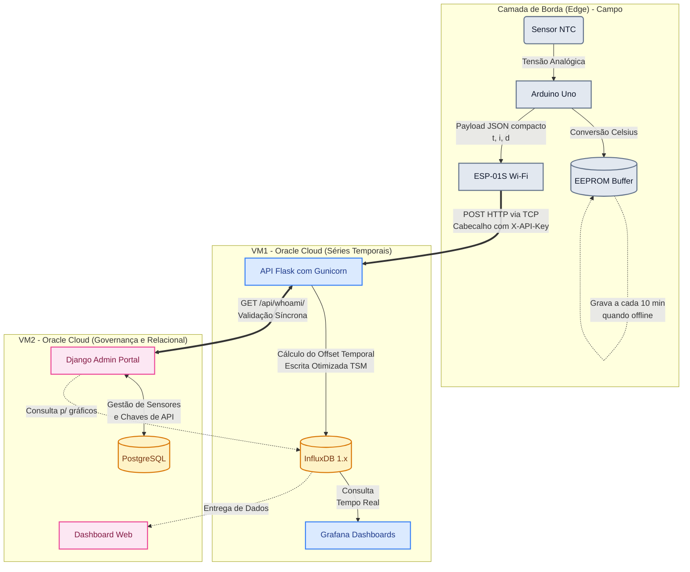
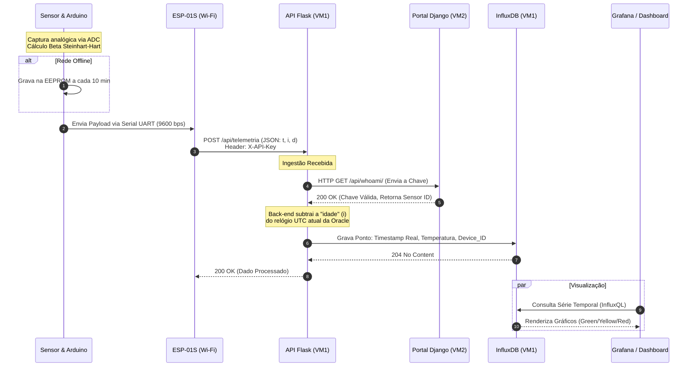

# Relatório Final Consolidado de Engenharia
## Projeto IoT Maricá
### Arquitetura de Telemetria de Alta Resiliência

**Disciplina:** Internet das Coisas (IoT)
**Curso:** Engenharia de Software (5º Período)
**Professor:** MSc. Márcio Alexandre Dias Garrido
**Data de Emissão:** Junho de 2026

**Integrantes:**
- Daniel Daigo Sasagawa (Matrícula: 202413740)
- Cauan Ferreira de Almeida (Matrícula: 202323031)
- Victor Ângelo Bastos Ferreira (Matrícula: 202412836)

---

## 🔗 Ecossistema de Repositórios (Entregáveis)

O projeto evoluiu de um simples script para uma arquitetura profissional de microsserviços. O código-fonte está distribuído nos seguintes repositórios:

1. 💻 **[Backend API (VM1)](#)**: O Coração da Nuvem (Flask + InfluxDB + Grafana). Recebe e armazena os dados brutos.
2. 🛡️ **[Portal Administrativo (VM2)](#)**: O Cérebro da Segurança (Django + PostgreSQL). Governança, cadastro de hardware e gestão de chaves de API.
3. 🌡️ **[Nó de Borda A (Telemetria NTC)](#)**: Firmware em C++ para Arduino Uno + ESP-01S via Wi-Fi.
4. 📡 **[Nó de Borda B (Gateway LoRa P2P)](#)**: Firmware avançado ESP32 para nós cegos em campo via rádio LoRa.

*(Substitua os `#` pelos links reais dos seus repositórios do GitHub).*

---

## 1. Visão Geral e Escopo Técnico

Este documento consolida todas as etapas de engenharia de hardware e software do sistema de telemetria térmica desenvolvido pela equipe. O objetivo central foi criar uma solução estável que contornasse limitações severas de hardware (falta de RAM, ausência de relógio RTC) e garantisse a **resiliência dos dados** em cenários de queda de energia e internet.

A arquitetura final resolve o problema da persistência com armazenamento offline inteligente na borda (EEPROM/SPIFFS) e sincronização cronológica na nuvem, assegurando que o histórico seja fiel ao evento físico.

---

## 2. A Jornada de Engenharia: Das Limitações à Nuvem

O sistema passou por diversas arquiteturas até a sua forma definitiva, orientada pelas restrições físicas encontradas.

### 2.1 A Ilusão do Serverless e o Estouro de Buffer (Fases 1 a 3)
A intenção original era enviar dados via HTTPS para a Vercel. Contudo, o módulo Wi-Fi **ESP-01S (1 MB de Flash, sem RAM para TLS)** sofreu sucessivos *Buffer Overflows* durante o handshake criptográfico. A solução foi retroceder para **TCP em texto plano**, e posteriormente usar o ThingSpeak como *relay*.

Entretanto, o ThingSpeak impôs um *Rate Limit* de 15 segundos. Se a rede ficasse offline por horas, descarregar a fila de dados acumulados seria inviável. Foi necessário assumir o controle total.

### 2.2 Migração para Nuvem Própria e InfluxDB (Fase 4)
Para quebrar os gargalos comerciais, a arquitetura foi migrada para uma **VPS na Oracle Cloud (Free Tier, 1GB RAM)**. A API em Python (Flask + Gunicorn) passou a receber ingestão direta, eliminando a retenção de 15 segundos e descarregando filas inteiras em milissegundos.

O banco NoSQL foi substituído pelo **InfluxDB 1.x**, altamente otimizado para séries temporais. Cálculos demonstram que 10 anos de telemetria de um dispositivo consomem irrisórios **~189 MB** de disco (graças ao motor de compressão TSM), provando a sustentabilidade do modelo.

### 2.3 Resiliência de Borda: A Máquina do Tempo em Software
Como o Arduino não tem um relógio RTC, ele perde a hora exata ao cair a rede. A equipe desenvolveu uma matemática de **Idade do Dado (Offset Temporal)**:
1. No instante da leitura offline, o Arduino salva o valor da temperatura na EEPROM junto com a marcação do cronômetro interno (`millis()`).
2. Quando a rede volta, ele compara o cronômetro atual com o cronômetro salvo e descobre há quantos segundos o fato ocorreu (`idade_segundos = (millis_atual - millis_salvo) / 1000`).
3. O pacote JSON enviado contém `{"t": 25.5, "i": 120}`.
4. O back-end em Python na nuvem pega seu próprio relógio UTC exato, subtrai os 120 segundos e injeta o dado no banco exatamente no passado.

### 2.4 Wear Leveling e o Magic Byte
A EEPROM do Arduino suporta apenas ~100.000 escritas antes do silício queimar. Escrever a cada 5 segundos a destruiria em dias. Implementou-se um algoritmo de **Wear Leveling**: quando offline, o sistema só salva dados a cada 10 minutos. Isso conferiu **16 horas e 40 minutos de autonomia offline** sem perder os traços críticos de temperatura, elevando a vida útil do chip para dezenas de anos.

Um *Magic Byte* (`0x42`) foi alocado no início da memória. Se a EEPROM for virgem (repleta de `0xFF`), o Arduino a formata automaticamente com zeros, impedindo a leitura de "temperaturas fantasmas".

---

## 3. Topologia de Hardware e o Ecossistema LoRa

O projeto expandiu para suportar não apenas nós Wi-Fi simples, mas um ecossistema complexo de rádio **LoRa P2P**:
- Os **Nós Cegos** no campo leem dados e transmitem *Structs Binárias* ultra-compactas de exatos **12 bytes** via LoRa. Essa técnica engenhosa evita o truncamento de pacotes comum no ar, descartando o uso de payloads pesados como JSON.
- O **Gateway Inteligente (ESP32)** recebe os pacotes, usa filas SPIFFS duplas para armazenamento offline, sincroniza-se via NTP quando tem internet e processa o descarregamento rápido para a nuvem usando o mesmo contrato matemático de `idade_segundos` da API.

---

## 4. Governança e Segurança Comercial (Django Portal)

A fase de maturação do produto exigia controle. Foi provisionada uma segunda VM para hospedar o **Portal Administrativo em Django + PostgreSQL**.

1. **Gestão do Parque:** Cadastro de equipamentos, modelos e status operacional.
2. **Cofre de Chaves:** O PostgreSQL gerencia as `X-API-Key`. A API Flask valida a chave consultando o Django de forma segura. Se uma chave vazar, o administrador revoga no portal com um clique, bloqueando invasores instantaneamente.
3. **Proteção Perimetral (Infraestrutura):** Os servidores estão blindados com **UFW** (bloqueio de todas as portas não essenciais) e **Fail2ban** para defesa ativa contra ataques de força bruta. O **Nginx** atua como proxy reverso aplicando *Rate Limiting*, absorvendo picos de tráfego e protegendo as APIs contra ataques de negação de serviço (DDoS).
4. **Auditoria Git:** O código-fonte foi escaneado pelo *GitGuardian*, atestando **Zero Incidentes Críticos** de vazamento de credenciais. As chaves de hardware são injetadas localmente via cofre de segredos (Infisical) e protegidas por `.gitignore`.

---

## 5. Visualização e Apresentação (Grafana e Dashboard Django)

A camada de operação visual foi dividida estrategicamente para atender dois públicos distintos:

**1. Grafana (Visão Operacional):**
Focado na exibição crua de séries temporais. Para evitar sobrecarga na VM de 1GB de RAM, o Grafana apenas plota agregações do InfluxDB usando *downsampling* e interpolação linear (`fill(previous)`), o que disfarça buracos na conexão. Para a apresentação da banca, configurou-se o modo Kiosk Anônimo (`?kiosk=true&refresh=5s`), focando apenas na curva térmica e nos alertas visuais (Verde, Amarelo e Vermelho de sobreaquecimento).

**2. Dashboard Django (Visão Gerencial Premium):**
Integrado nativamente ao Portal Administrativo na VM2. O painel (construído sobre o tema *Unfold*) consulta o InfluxDB em tempo real, realizando *queries* de agrupamento para despejar os dados mastigados na interface web. Ele proporciona uma visão gerencial completa que une as informações de cadastro do banco relacional (hardware, status de chaves) com a telemetria do banco temporal, tudo em uma única tela de estética avançada.

---

## 6. Diagramas de Arquitetura e Fluxo

### 6.1 Topologia da Arquitetura (Visão Macro)



### 6.2 Diagrama de Sequência (Fluxo de Dados)



---

## 7. Conclusão de Engenharia

O Projeto IoT Maricá é a prova de que severas restrições físicas (1 MB de Flash, 2 KB de RAM) e limitações comerciais de nuvem podem ser superadas por meio de **design de software inteligente**.

A junção de cálculos de degradação de silício, sincronização temporal assíncrona por offsets, compactação binária de rádio frequência (LoRa) e uma separação madura entre a alta velocidade da ingestão temporal (InfluxDB) e a segurança relacional (Django), elevam esta entrega acadêmica a um **padrão de confiabilidade industrial**.

---

## Anexo: Instruções de Compilação (Firmware)

Caso você deseje compilar ou alterar o código-fonte em C++ (`src/main.cpp`):

1. Abra a pasta `Sensor_NTC` no **PlatformIO** (VS Code).
2. Ajuste o arquivo `src/secrets.h` com as suas chaves e senhas (o arquivo de exemplo é o `secrets.h.example`).
3. Compile o projeto via terminal ou interface:
```powershell
platformio run
```
4. Para fazer upload via cabo USB:
```powershell
platformio run --target upload
```
